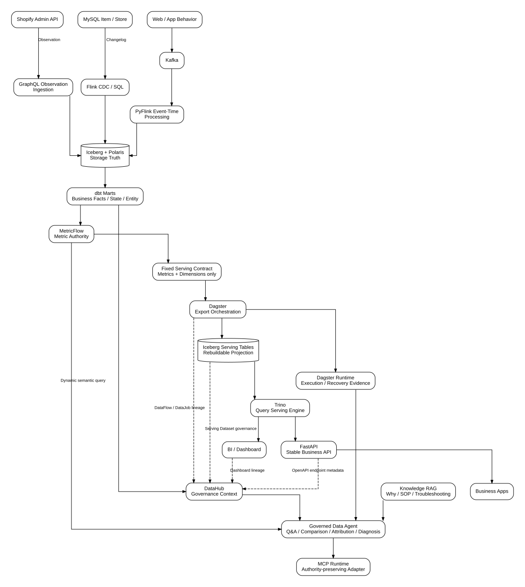

# AI-Native Governed Data Platform & Data Agent

[](https://github.com/lcx921203/ai-native-governed-data-platform/actions/workflows/ci.yml)


一个以 **Shopify Commerce** 为业务场景构建的现代湖仓数据平台与治理型数据 Agent 工程。

项目重点不是“自然语言生成 SQL”，而是把 **业务事实（Business Facts）→ 统一指标（Metric Authority）→ 数据治理（Governance）→ 编排与运行证据（Runtime Evidence）→ Agent 工具调用** 串成一套可验证、可追踪、可治理的数据体系，同时服务 Agent、BI 和业务 API。

> **工程定位**：生产级架构设计 + 可执行源码 + 静态/契约验证。真实 Runtime Acceptance（运行时验收）与静态 PASS 严格区分，不把未执行的真实外部运行写成已落地结果。

## 项目亮点

- **多源统一但不抹平语义**：Shopify API、MySQL CDC、行为日志分别按 Observation（观测）、Change（变更）、Event（事件）建模。
- **湖仓建模与业务版本治理**：Iceberg + dbt，将 Raw 数据转成稳定 Business Version（业务版本）与 Marts（业务集市）。
- **统一语义层**：MetricFlow 统一指标定义、业务时间语义和转化指标，避免 Agent、BI、API 各自重复计算。
- **治理型 Agent**：支持语义问答、时间对比、维度下钻、异常检测、归因分析、运行诊断、治理问答与知识 RAG。
- **治理与运行证据闭环**：DataHub 管理 Dataset / Domain / Owner / Tag / Glossary / Lineage，Dagster 管理编排、恢复与运行事实。
- **工程化 CI**：GitHub Actions 对静态质量、完整契约测试以及多个隔离运行时的依赖解析分别验证，当前主分支 CI 全绿。

## 一张图看懂架构



可编辑架构源文件：

```text
docs/architecture/AI_NATIVE_DATA_AGENT.mmd
docs/architecture/AI_NATIVE_DATA_AGENT.dot
docs/architecture/AI_NATIVE_DATA_AGENT.svg
```

核心链路：

```text
Commerce Sources
      ↓
Source-aware Ingestion
      ↓
Iceberg Raw / Source / Realtime
      ↓
Business Version + dbt Marts
      ↓
MetricFlow ───────────────────────────────→ Governed Agent
Metric Authority                                  ↑
      │                                           │
      └→ Fixed Serving Contract                   │
             ↓                                    │
          Dagster                                 │
             ↓                                    │
      Iceberg Serving                             │
             ↓                                    │
           Trino                                  │
        ┌────┴────┐                               │
        ↓         ↓                               │
       BI      FastAPI → Business Apps            │
                                                    │
DataHub Governance + Runtime Evidence + RAG ────────┘
```

## 技术栈

| 领域 | 主要技术 |
| --- | --- |
| 数据采集 | Shopify Admin GraphQL、Flink CDC、Kafka、PyFlink |
| 湖仓 | Apache Iceberg、Spark |
| 建模 | dbt、维度建模、生命周期快照、增量建模 |
| 语义层 | MetricFlow |
| 编排 | Dagster |
| 查询服务 | Trino、FastAPI |
| 数据治理 | DataHub |
| Agent / RAG | Governed Tool Registry、MCP、Qdrant、Rerank |
| 工程化 | Python 3.11、pytest、GitHub Actions、uv |

## 关键设计

### 1. Source Truth（源数据真相）

不同数据源保留各自的数据语义，而不是强行使用同一种采集模型：

```text
Shopify Admin GraphQL      → Observation
MySQL binlog / Flink CDC   → Change / Changelog
Behavior Collector + Kafka → Event
```

这使后续模型能够区分“某时刻观察到的状态”“发生过的变更”和“业务事件”。

### 2. Business Facts & Modeling（业务事实与建模）

```text
Raw Observation / Change / Event
              ↓
Deterministic Business Version
              ↓
dbt Source → Staging → Intermediate → Marts
              ↓
Transaction Fact / Current State / Event / Lifecycle Snapshot
```

实现重点包括：

- Affected-key Incremental Modeling（受影响 Key 增量重算）
- Rollback-safe Version Semantics（可回滚版本语义）
- Order Grain Lifecycle Snapshot（订单粒度生命周期快照）
- Transaction Fact / Current State / Event 分工

### 3. Semantic Layer（语义层）

MetricFlow 负责统一指标定义和业务时间语义，消费者不重新定义公式。

指标治理包含 append-only 的 **Metric Version Lifecycle（指标版本生命周期）**：

```text
metric_registry.yml
      ↓ 当前业务版本
metric_lifecycle.yml
      ↓ 历史状态 / effective time / supersedes
SHA-256 definition fingerprint
      ↓
CI 阻止 ACTIVE 指标被静默改写
```

订单生命周期转化指标建立在“一行一个 Order”的 `order_lifecycle_snapshot` 上，例如：

- Order → Paid within 24h
- Order → Fulfillment within 3d
- Order → Delivered within 7d

这样转化指标保持在 Order Grain（订单粒度），避免直接关联 Payment / Fulfillment 明细事实导致重复计数。

### 4. Orchestration & Recovery（编排与恢复）

Dagster 管理逻辑分区、Asset 依赖、Schedule（调度）、Freshness（新鲜度）、失败分类和受控恢复。

关键边界：

```text
Schedule ≠ Freshness
Run SUCCESS ≠ Exact Partition Completeness
Step Retry ≠ Cross-run Recovery
```

### 5. Data Governance（数据治理）

DataHub 管理：

```text
Dataset Identity
Domain
Owner
Tags
Glossary
Structured Properties
Lineage
```

Serving 治理继续延伸到消费端：

```text
Marts → Dagster DataFlow/DataJob → Serving Dataset
                                  ├→ Dashboard
                                  └→ OpenAPI Endpoint Dataset
```

### 6. Governed Data Agent（治理型数据 Agent）

Agent 当前工程能力覆盖：

```text
Semantic Q&A
Clarification / Multi-turn State
Time Comparison
Dimension Breakdown
Anomaly Detection
Driver Attribution
Operational Diagnosis
Incident Drilldown
Governance Q&A
Knowledge RAG
Human Approval Lifecycle
```

Agent 是 **read-oriented（以读取分析为主）** 且受 Authority Boundary（权威边界）约束。

```text
APPROVED ≠ EXECUTED
```

不会把 Agent 的“批准状态”误写成真实生产执行结果。

### 7. Knowledge RAG（知识检索增强）

```text
Governed Corpus
    ↓
Structure-aware Chunking
    ↓
Embedding
    ↓
Qdrant
    ↓
Optional Rerank
    ↓
Exact Fetch
```

RAG 负责 Why / Design / SOP / Troubleshooting 等解释型证据，但不能替代：

- MetricFlow 的数值与指标真相
- DataHub 的身份与治理真相
- Dagster 的运行事实

### 8. MCP Runtime

MCP 是协议适配层，不是新的权威来源：

```text
Deployment Profile
      ↓
OAuth Scope
      ↓
Governed Tool Registry
      ↓
Execution
```

Agent 不暴露任意 SQL / Shell / Python / DataHub mutation / Dagster launch。

### 9. Serving Layer（服务层）

固定 BI / API 工作负载复用 MetricFlow 语义，但可以走独立物理服务链路：

```text
MetricFlow
  → Serving Contract
  → Dagster
  → Spark exact-partition Iceberg overwrite
  → Trino
  → BI / FastAPI
```

Serving Table 是可重建 Projection（投影），不是新的 Business Truth（业务真相）。

## Repository Map（目录结构）

```text
ingestion/                       多源采集
lakehouse/                       Raw → Business Version / physical jobs
dbt/mercaso_dbt/                dbt 模型 + MetricFlow 语义定义
orchestration/dagster/           Assets / checks / schedules / recovery
metadata/datahub/                数据治理契约 + runtime tools
agent/                           分析 / 诊断 / RAG / governed tools
knowledge/                       治理知识库
mcp_server/                      MCP 协议入口
serving/                         BI/API contracts、export、FastAPI
infra/trino/                     Trino + Iceberg 查询服务
infra/runtime/                   静态与真实 Runtime Acceptance runners
acceptance/                      Recovery acceptance scenarios
tests/                           Static / contract / unit acceptance
docs/                            架构、设计决策、运行手册
```

## Quick Start（快速验证）

Python 3.11：

```bash
python -m venv .venv
source .venv/bin/activate
pip install -r requirements-ci.txt
pytest -q
```

当前 Source / Static Contract Suite：

```text
413 passed
```

GitHub Actions 还会分别验证各运行时的依赖可解析性，避免为了“装进一个大环境”而破坏真实组件边界。

## CI & Runtime Isolation（持续集成与运行时隔离）

当前 CI 分成三类质量门禁：

```text
Static quality gate
  └─ Python / Shell / YAML / JSON / source-comment contracts

Full static contract suite
  └─ 完整 repository pytest contracts

Dependency resolution
  └─ dbt / Dagster / DataHub / MetricFlow / Agent / RAG / MCP / Serving / Streaming 等环境独立解析
```

项目刻意采用多个 Python Runtime Environment（运行时环境），因为不同上游组件存在真实版本边界：

```text
requirements-dbt.txt                 dbt 1.12 modeling runtime
requirements-dagster.txt             Dagster + dagster-dbt / dbt 1.11 runtime
requirements-metricflow-compat.txt   MetricFlow compatibility runtime
requirements-datahub.txt             DataHub governance runtime
requirements-rag.txt                 RAG runtime
requirements-mcp.txt                 MCP runtime
requirements-serving.txt             FastAPI / Trino client
requirements-streaming.txt           Flink / Kafka runtime
```

特别是 Dagster host 与 DataHub governance runtime 当前依赖不同 `sqlglot` 版本，因此 CI 不会强行把它们塞进同一个 Python 环境。

Canonical Workflows：

```text
.github/workflows/ci.yml
.github/workflows/dependency-locks.yml
```

依赖锁策略：

```text
requirements/locks/LOCK_POLICY.yml
```

## Runtime Acceptance（真实运行验收）

项目把真实运行证据保存在 `.runtime/`，并从 Git 中排除。

```text
Static / Source PASS ≠ Runtime PASS
```

最终运行闭环要求真实外部依赖、凭证和基础设施准备完成后再执行 Runtime Acceptance。例如 Serving 路径：

```bash
SERVING_ALLOW_RUNTIME_ACCEPTANCE=true \
./infra/runtime/run_serving_runtime.sh 2026-08-20
```

完整运行边界见：

```text
CURRENT_SOURCE_STATE.md
PROJECT_STATUS.md
docs/PROJECT_COMPLETENESS_AUDIT.md
```

## Engineering Boundaries（工程边界）

```text
Observation ≠ Business Version
Execution Window ≠ Business Time
Static Contract ≠ Runtime Observation
Expected Dataset URN ≠ Resolved Runtime Identity
REFERENCE_ONLY ≠ SEMANTIC_READY
RAG Evidence ≠ Runtime Fact
Serving Projection ≠ Metric Authority
Agent Approval ≠ Production Execution
```

## Source Comment Standard（源码注释规范）

核心源码遵循：

```text
docs/SOURCE_COMMENT_STANDARD.md
```

注释重点解释业务逻辑、关键 API / 语法、输入输出、数据语义以及工程边界，而不是重复代码本身。
